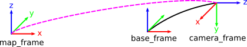
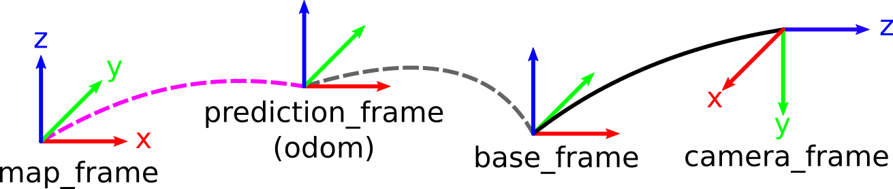

S-PTAM is a Stereo SLAM system able to compute the camera trajectory in real-time. It heavily exploits the parallel nature of the SLAM problem, separating the time-constrained pose estimation from less pressing matters such as map building and refinement tasks. On the other hand, the stereo setting allows to reconstruct a metric 3D map for each frame of stereo images, improving the accuracy of the mapping process with respect to monocular SLAM and avoiding the well-known bootstrapping problem. Also, the real scale of the environment is an essential feature for robots which have to interact with their surrounding workspace.

<a href="http://www.youtube.com/watch?feature=player_embedded&v=ojBB07JvDrY
" target="_blank"></a>  
(Click the image to redirect to S-PTAM video)

## Related Publications:
[1]  Taihú Pire,Thomas Fischer, Gastón Castro, Pablo De Cristóforis, Javier Civera and Julio Jacobo Berlles.
**S-PTAM: Stereo Parallel Tracking and Mapping**
Robotics and Autonomous Systems, 2017.


[2] Taihú Pire, Thomas Fischer, Javier Civera, Pablo De Cristóforis and Julio Jacobo Berlles.  
**Stereo Parallel Tracking and Mapping for Robot Localization**  
Proc. of The International Conference on Intelligent Robots and Systems (IROS), Hamburg, Germany, 2015.

## Table of Contents
  - [License](#license)
  - [Disclaimer](#disclaimer)
  - [Dependencies](#dependencies)
    - [ROS](#ros)
    - [ros-utils](#ros-utils)
    - [g2o](#g2o)
    - [Loop Closure Dependencies](#loop-closure-dependencies)
      - [DLib](#dlib)
      - [DBoW2](#dbow2)
	  - [DLoopDetector](#dloopdetector)
      - [OpenGV](#opengv)
  - [Installation](#installation)
  - [ROS Package](#ros-package)
    - [ROS Compilation](#ros-compilation)
    - [Tutorials](#tutorials)
      - [KITTI dataset](#kitti-dataset)
      - [EuRoc MAV dataset](#euroc-mav-dataset)
      - [MIT Stata Center dataset](#mit-stata-center-dataset)
      - [Indoor Level 7 S-Block dataset](#indoor-level-7-s-block-dataset)
    - [Node Information](#node-information)
      - [Subscribed Topics](#subscribed-topics)
      - [Published Topics](#published-topics)
      - [ROS Parameters](#ros-parameters)
      - [Involved Coordinates Systems](#involved-coordinates-systems)
  - [CMAKE flags](#cmake-flags)
  - [S-PTAM Parameters](#s-ptam-parameters)
  - [Standalone](#standalone)
    - [Compilation](#compilation)
    - [Run](#run)

# License

S-PTAM is released under GPLv3 license.

For a closed-source version of S-PTAM for commercial purposes, please contact the authors.

If you use S-PTAM in an academic work, please cite:

@article{pire2017sptam,  
&nbsp;&nbsp;&nbsp;&nbsp;&nbsp;&nbsp;&nbsp;&nbsp;&nbsp;
  title = {{S-PTAM: Stereo Parallel Tracking and Mapping}},  
&nbsp;&nbsp;&nbsp;&nbsp;&nbsp;&nbsp;&nbsp;&nbsp;&nbsp;
  author = {Pire, Taih{\\'u} and Fischer, Thomas and Castro, Gast{\\'o}n and De Crist{\\'o}foris, Pablo and Civera, Javier and Jacobo Berlles, Julio},  
&nbsp;&nbsp;&nbsp;&nbsp;&nbsp;&nbsp;&nbsp;&nbsp;&nbsp;
  journal = {Robotics and Autonomous Systems (RAS)},  
&nbsp;&nbsp;&nbsp;&nbsp;&nbsp;&nbsp;&nbsp;&nbsp;&nbsp;
  volume = {93},  
&nbsp;&nbsp;&nbsp;&nbsp;&nbsp;&nbsp;&nbsp;&nbsp;&nbsp;
  pages = {27 -- 42},  
&nbsp;&nbsp;&nbsp;&nbsp;&nbsp;&nbsp;&nbsp;&nbsp;&nbsp;
  year = {2017},  
&nbsp;&nbsp;&nbsp;&nbsp;&nbsp;&nbsp;&nbsp;&nbsp;&nbsp;
  issn = {0921-8890},  
&nbsp;&nbsp;&nbsp;&nbsp;&nbsp;&nbsp;&nbsp;&nbsp;&nbsp;
  doi = {10.1016/j.robot.2017.03.019}  
}

@inproceedings{pire2015sptam,  
&nbsp;&nbsp;&nbsp;&nbsp;&nbsp;&nbsp;&nbsp;&nbsp;&nbsp;
  title={{Stereo Parallel Tracking and Mapping for robot localization}},  
&nbsp;&nbsp;&nbsp;&nbsp;&nbsp;&nbsp;&nbsp;&nbsp;&nbsp;
  author={Pire, Taih{\\'u} and Fischer, Thomas and Civera, Javier and De Crist{\\'o}foris, Pablo and Jacobo berlles, Julio},  
&nbsp;&nbsp;&nbsp;&nbsp;&nbsp;&nbsp;&nbsp;&nbsp;&nbsp;
  booktitle={Proc. of the International Conference on Intelligent Robots and Systems (IROS)},   
&nbsp;&nbsp;&nbsp;&nbsp;&nbsp;&nbsp;&nbsp;&nbsp;&nbsp;
  pages = {1373--1378},  
&nbsp;&nbsp;&nbsp;&nbsp;&nbsp;&nbsp;&nbsp;&nbsp;&nbsp;
  year={2015},  
&nbsp;&nbsp;&nbsp;&nbsp;&nbsp;&nbsp;&nbsp;&nbsp;&nbsp;
  month = {September},  
&nbsp;&nbsp;&nbsp;&nbsp;&nbsp;&nbsp;&nbsp;&nbsp;&nbsp;
  doi = {10.1109/IROS.2015.7353546}  
 }

# Disclaimer
This site and the code provided here are under active development. Even though we try to only release working high quality code, this version might still contain some issues. Please use it with caution.

# Dependencies

## ROS

We have tested S-PTAM in Ubuntu 16.04 with ROS Kinetic.

To install ROS (Kinetic) use the following command:

`sudo apt-get install ros-kinetic-desktop`

## SuiteSparse

Suitespare is a dependency, so it needs to be installed

`sudo apt-get install libsuitesparse-dev`

## ros-utils

Install our [ros-utils](https://github.com/lrse/ros-utils) library from the source code provided in  

`git clone git@github.com:lrse/ros-utils.git`

## g2o

Install [g2o](https://github.com/RainerKuemmerle/g2o) library from the source code provided in  

`git clone git@github.com:RainerKuemmerle/g2o.git`

Tested until commit [4b9c2f5b68d14ad479457b18c5a2a0bce1541a90](https://github.com/RainerKuemmerle/g2o/commit/4b9c2f5b68d14ad479457b18c5a2a0bce1541a90)

`git checkout 4b9c2f5b68d14ad479457b18c5a2a0bce1541a90`

```
mkdir build && cd build
cmake ..
make 
sudo make install
```

## Loop Closure dependencies

Only required when USE_LOOPCLOSURE flag is defined. 

DBoW2 vocabularies
are available through a git submodule at the bow_voc directory

`git submodule update --init --recursive`


### DLib

Install [DLib](https://github.com/dorian3d/DLib) library from source code

`git clone git@github.com:dorian3d/DLib.git`

Tested until commit [70089a38056e8aebd5a2ebacbcb67d3751433f32](https://github.com/dorian3d/DLib/commit/70089a38056e8aebd5a2ebacbcb67d3751433f32)

`git checkout 70089a38056e8aebd5a2ebacbcb67d3751433f32`


### DBoW2

Install [DBoW2](https://github.com/dorian3d/DBoW2) library from source code

`git clone git@github.com:dorian3d/DBoW2.git`

Tested until commit [82401cad2cfe7aa28ee6f6afb01ce3ffa0f59b44](https://github.com/dorian3d/DBoW2/commit/82401cad2cfe7aa28ee6f6afb01ce3ffa0f59b44)

`git checkout 82401cad2cfe7aa28ee6f6afb01ce3ffa0f59b44`

### DLoopDetector

Install [DLoopDetector](https://github.com/dorian3d/DLoopDetector) library from source code

`git clone git@github.com:dorian3d/DLoopDetector.git`

Tested until commit [8e62f8ae84d583d9ab67796f779272b0850571ce](https://github.com/dorian3d/DLoopDetector/commit/8e62f8ae84d583d9ab67796f779272b0850571ce)

`git checkout 8e62f8ae84d583d9ab67796f779272b0850571ce`


## OpenGV

Install [OpenGV](https://github.com/laurentkneip/opengv) library from source code

`git clone git@github.com:laurentkneip/opengv.git`

Tested until commit [2e2d21917fd2fb75f2134e6d5be7a2536cbc7eb1](https://github.com/laurentkneip/opengv/commit/2e2d21917fd2fb75f2134e6d5be7a2536cbc7eb1)

`git checkout 2e2d21917fd2fb75f2134e6d5be7a2536cbc7eb1`

# Installation

`git clone git@github.com:lrse/sptam.git`

# ROS Package

## ROS Compilation

`catkin_make --pkg sptam -DCMAKE_BUILD_TYPE=RelWithDebInfo -DSINGLE_THREAD=OFF -DSHOW_TRACKED_FRAMES=ON -DSHOW_PROFILING=ON -DPARALLELIZE=ON`

To activate Loop Closing capabilities (requires DBoW2 and OpenGV dependencies).

`catkin_make --pkg sptam -DCMAKE_BUILD_TYPE=RelWithDebInfo -DUSE_LOOPCLOSURE=ON -DSINGLE_THREAD=OFF -DSHOW_TRACKED_FRAMES=ON -DSHOW_PROFILING=ON -DPARALLELIZE=ON`

For more information about compilation flags see [CMAKE flags](#cmakeFlags) section.

## Tutorials

We provide some examples of how to run S-PTAM with the most popular stereo datasets

### KITTI dataset

1. Download the KITTI rosbag [kitti_00.bag](http://fs01.cifasis-conicet.gov.ar:90/~pire/datasets/KITTI/bags/kitti_00.bag) provided in   [KITTI rosbag files](http://fs01.cifasis-conicet.gov.ar:90/~pire/datasets/KITTI/bags/)  

2. Uncompress the dataset  

	`rosbag decompress kitti_00.bag`  

3. Set `use_sim_time` ros variable `true`  

    `rosparam set use_sim_time true`  

4.  Play the dataset  

	`rosbag play --clock kitti_00.bag`  
	
	(When S-PTAM run with the flag SHOW_TRACKED_FRAMES=ON the performance is reduced notoriusly).
5. Run sptam using the kitti.launch  

    `roslaunch sptam kitti.launch`  

### EuRoc MAV dataset

1. Download the EuRoc rosbag [Machine Hall 01](http://robotics.ethz.ch/~asl-datasets/ijrr_euroc_mav_dataset/machine_hall/MH_01_easy/MH_01_easy.bag) provided in   [EuRoc MAV Web Page](http://projects.asl.ethz.ch/datasets/doku.php?id=kmavvisualinertialdatasets)  

2. Add left and right camera_info messages in the rosbag

   In S-PTAM package we provide a script `euroc_add_camera_info.py` to add left and right [sensor\_msgs/CameraInfo](http://docs.ros.org/api/sensor_msgs/html/msg/CameraInfo.html) messages to the EuRoc MAV rosbags.  

    `python sptam_directory/scripts/euroc_add_camera_info.py MH_01_easy.bag /mav0/cam0/sensor.yaml /mav0/cam1/sensor.yaml`
  

3. Set `use_sim_time` ros variable `true`  

    `rosparam set use_sim_time true`  

4.  Play the dataset  

	`rosbag play --clock MH_01_easy_with_camera_info.bag -s 50`  
	 
5. Run sptam using the euroc.launch  

    `roslaunch sptam euroc.launch`  

### MIT Stata Center dataset

1. Download the MIT Stata Center rosbag [2012-01-27-07-37-01.bag](http://infinity.csail.mit.edu/data/2012/2012-01-27-07-37-01.bag) provided in   [MIT Stata Center Web Page](http://projects.csail.mit.edu/stata/downloads.php)  

2. Set use_sim_time ros variable true  

    `rosparam set use_sim_time true`  

3.  Play the dataset  

	`rosbag play --clock 2012-01-27-07-37-01.bag -s 302.5 -u 87`  
	 
	(Here we are running the [part 3 of the sequence](http://infinity.csail.mit.edu/data/2012/utilities/2012-01-27-07-37-01) where ground-truth was provided that is why the bag file start from a different timestamp)

4. Run sptam using the mit.launch  

    `roslaunch sptam mit.launch`  


### Indoor Level 7 S-Block dataset

1. Download the Level7 rosbag [level07_20_05_12_trunc.bag (3747 Frame Subset)](https://wiki.qut.edu.au/display/cyphy/Indoor+Level+7+S-Block+Dataset) provided in [Indoor Level 7 S-Block Dataset Web Page](https://wiki.qut.edu.au/display/cyphy/Indoor+Level+7+S-Block+Dataset)  

2. Set `use_sim_time` ros variable `true`  

    `rosparam set use_sim_time true`  

3.  Play the dataset  

	`rosbag play --clock level7_truncated.bag`  
	 

4. Run sptam using the level7.launch  

    `roslaunch sptam level7.launch`  


## Node Information

### Subscribed Topics

Camera topics should provide undistorted and stereo-rectified images. Consider using the [image_proc](http://wiki.ros.org/stereo_image_proc) node.

/stereo/left/image\_rect ([sensor\_msgs/Image](http://docs.ros.org/api/sensor_msgs/html/msg/Image.html))  
&nbsp;&nbsp;&nbsp;&nbsp;&nbsp;&nbsp;&nbsp;&nbsp;&nbsp;
Undistorted and stereo-rectified image stream from the left camera.

/stereo/left/camera\_info ([sensor\_msgs/CameraInfo](http://docs.ros.org/api/sensor_msgs/html/msg/CameraInfo.html))  
&nbsp;&nbsp;&nbsp;&nbsp;&nbsp;&nbsp;&nbsp;&nbsp;&nbsp;
Left camera metadata.

/stereo/right/image\_rect ([sensor\_msgs/Image](http://docs.ros.org/api/sensor_msgs/html/msg/Image.html))  
&nbsp;&nbsp;&nbsp;&nbsp;&nbsp;&nbsp;&nbsp;&nbsp;&nbsp;
Undistorted and stereo-rectified image stream from the right camera.

/stereo/right/camera\_info ([sensor\_msgs/CameraInfo](http://docs.ros.org/api/sensor_msgs/html/msg/CameraInfo.html))  
&nbsp;&nbsp;&nbsp;&nbsp;&nbsp;&nbsp;&nbsp;&nbsp;&nbsp;
Right camera metadata.

### Published Topics

global_map ([sensor\_msgs/PointCloud2](http://docs.ros.org/api/sensor_msgs/html/msg/PointCloud2.html))  
&nbsp;&nbsp;&nbsp;&nbsp;&nbsp;&nbsp;&nbsp;&nbsp;&nbsp;
Global sparse mapped point cloud used for tracking.  

local_map ([sensor\_msgs/PointCloud2](http://docs.ros.org/api/sensor_msgs/html/msg/PointCloud2.html))  
&nbsp;&nbsp;&nbsp;&nbsp;&nbsp;&nbsp;&nbsp;&nbsp;&nbsp;
Local map which contains points that are highly probable to be observed by the current camera.

tracked_map ([sensor\_msgs/PointCloud2](http://docs.ros.org/api/sensor_msgs/html/msg/PointCloud2.html))  
&nbsp;&nbsp;&nbsp;&nbsp;&nbsp;&nbsp;&nbsp;&nbsp;&nbsp;
Points tracked by the current camera.

keyframes ([nav_msgs/Path](http://docs.ros.org/api/nav_msgs/html/msg/Path.html))  
&nbsp;&nbsp;&nbsp;&nbsp;&nbsp;&nbsp;&nbsp;&nbsp;&nbsp;
All the keyframes generated along the whole trajectory.

local_keyframes ([nav_msgs/Path](http://docs.ros.org/api/nav_msgs/html/msg/Path.html))  
&nbsp;&nbsp;&nbsp;&nbsp;&nbsp;&nbsp;&nbsp;&nbsp;&nbsp;
Keyframes used to obtain the local map (local_map).

camera_pose ([geometry\_msgs::PoseWithCovarianceStamped](http://docs.ros.org/kinetic/api/geometry_msgs/html/msg/PoseWithCovarianceStamped.html))  
&nbsp;&nbsp;&nbsp;&nbsp;&nbsp;&nbsp;&nbsp;&nbsp;&nbsp;
Current camera pose computed after tracking.

<!--
path ([nav\_msgs/Path](http://docs.ros.org/api/nav_msgs/html/msg/Path.html))  
&nbsp;&nbsp;&nbsp;&nbsp;&nbsp;&nbsp;&nbsp;&nbsp;&nbsp;
Path navigated by the robot, following the poses computed by the tracker.
-->

### ROS Parameters

~use\_prediction (bool, default: false)  
&nbsp;&nbsp;&nbsp;&nbsp;&nbsp;&nbsp;&nbsp;&nbsp;&nbsp;
Replace decay velocity motion model by a pose prediction that will be read from the TF tree. If using this, please make sure you have also set the correct prediction\_frame option.

~approximate_sync: (bool, default: false)  
&nbsp;&nbsp;&nbsp;&nbsp;&nbsp;&nbsp;&nbsp;&nbsp;&nbsp;
Whether to use approximate synchronization for stereo frames. Set to true if the left and right Cameras do not produce identical synchronized timestamps for a matching pair of frames.

~publish_transform: (bool, default: true)  
&nbsp;&nbsp;&nbsp;&nbsp;&nbsp;&nbsp;&nbsp;&nbsp;&nbsp;
Whether to publish the transformation associated to the newly computed camera pose to the TF tree.

~publish_on_fail: (bool, default: false)  
&nbsp;&nbsp;&nbsp;&nbsp;&nbsp;&nbsp;&nbsp;&nbsp;&nbsp;
Whether to publish pose and tf updates when the tracking fails.

~prediction\_frame (string, default: "odom")  
&nbsp;&nbsp;&nbsp;&nbsp;&nbsp;&nbsp;&nbsp;&nbsp;&nbsp;
Reference frame for predictions in the TF tree. If use\_prediction option is enabled, some source outside of the S-PTAM node is required to publish the transformation between prediction\_frame and camera\_frame.

~base\_frame: (string, default: "base\_link")  
&nbsp;&nbsp;&nbsp;&nbsp;&nbsp;&nbsp;&nbsp;&nbsp;&nbsp;
Reference frame for the robot. This is the frame whose pose will be published on the /robot/pose topic and the TF tree (if tf publication is enabled).

~camera\_frame: (string, default: "camera")  
&nbsp;&nbsp;&nbsp;&nbsp;&nbsp;&nbsp;&nbsp;&nbsp;&nbsp;
Reference frame for the left camera, used to get left camera pose from tf.

~map\_frame: (string, default: "map")  
&nbsp;&nbsp;&nbsp;&nbsp;&nbsp;&nbsp;&nbsp;&nbsp;&nbsp;
Name for the published map frame.

~reference\_frame: (string, default: "base_link")  
&nbsp;&nbsp;&nbsp;&nbsp;&nbsp;&nbsp;&nbsp;&nbsp;&nbsp;
This is the frame that the map frame will be aligned to when initializing S-PTAM. In other word, the initial pose of the reference\_frame defines the map origin.

### Involved Coordinates Systems

Example of common used coordinate systems. Here, reference_frame follows the base_frame axis representation.



The camera correction computed by S-PTAM is applied between the map_frame and the base_frame (pink doted line).



The camera correction computed by S-PTAM is applied between the map_frame and the prediction_frame (pink doted line).

# CMAKE flags

SINGLE_THREAD=([ON|OFF], default: OFF)  
&nbsp;&nbsp;&nbsp;&nbsp;&nbsp;&nbsp;&nbsp;&nbsp;&nbsp;
Make to S-PTAM runs tracking and mapping tasks in single thread mode, this is, tracking and mapping runs in only one thread. This options could be useful for debugging. Set it OFF to improve S-PTAM performance.

SHOW_TRACKED_FRAMES=([ON|OFF], default: OFF)  
&nbsp;&nbsp;&nbsp;&nbsp;&nbsp;&nbsp;&nbsp;&nbsp;&nbsp;
Show the tracked frames by S-PTAM. Set it OFF to improve S-PTAM performance.

SHOW_PROFILING=([ON|OFF], default: OFF)  
&nbsp;&nbsp;&nbsp;&nbsp;&nbsp;&nbsp;&nbsp;&nbsp;&nbsp;
Create a log file of S-PTAM. This log file can be used to depure S-PTAM. Set it OFF to improve S-PTAM performance.

PARALLELIZE=([ON|OFF], default: ON)  
&nbsp;&nbsp;&nbsp;&nbsp;&nbsp;&nbsp;&nbsp;&nbsp;&nbsp;
Make to S-PTAM uses parallelize code when is possible. Set it ON to improve S-PTAM performance.

USE_LOOPCLOSURE=([ON|OFF], default: OFF)  
&nbsp;&nbsp;&nbsp;&nbsp;&nbsp;&nbsp;&nbsp;&nbsp;&nbsp;
Activates loop closing capabilities of S-PTAM. Requires DBoW2 and OpenGV dependencies. Set it OFF to use S-PTAM without loop detection.

# S-PTAM Parameters

~FeatureDetector/Name: (string, default: "GFTT")  
&nbsp;&nbsp;&nbsp;&nbsp;&nbsp;&nbsp;&nbsp;&nbsp;&nbsp;
Follows OpenCV convention.

~DescriptorExtractor/Name: (string, default: "BRIEF")  
&nbsp;&nbsp;&nbsp;&nbsp;&nbsp;&nbsp;&nbsp;&nbsp;&nbsp;
Follows OpenCV convention.

~DescriptorMatcher/Name: 'BruteForce-Hamming'  
&nbsp;&nbsp;&nbsp;&nbsp;&nbsp;&nbsp;&nbsp;&nbsp;&nbsp;
Follows OpenCV convention.

~DescriptorMatcher/crossCheck: false  
&nbsp;&nbsp;&nbsp;&nbsp;&nbsp;&nbsp;&nbsp;&nbsp;&nbsp;
Follows OpenCV convention.

~MatchingCellSize: (int, default: 15)  
&nbsp;&nbsp;&nbsp;&nbsp;&nbsp;&nbsp;&nbsp;&nbsp;&nbsp;
To match the map points with images features, each frame is divided in squares cells of fixed size. MatchingCellSize define the size of each cell.

~MatchingNeighborhood: (int, default: 2)  
&nbsp;&nbsp;&nbsp;&nbsp;&nbsp;&nbsp;&nbsp;&nbsp;&nbsp;Cells' neighborhood around the point.

~MatchingDistance: (double, default: 25.0)  
&nbsp;&nbsp;&nbsp;&nbsp;&nbsp;&nbsp;&nbsp;&nbsp;&nbsp;
Descriptor distance. Use a non-fractional value when hamming distance is used. Use Fractional value when L1/L2 norm is used.

~EpipolarDistance: (double, default: 0.0)  
&nbsp;&nbsp;&nbsp;&nbsp;&nbsp;&nbsp;&nbsp;&nbsp;&nbsp;
Distance in rows from the epipolar line used to find stereo matches.

~FrustumNearPlaneDist: (double, default: 0.1)  
&nbsp;&nbsp;&nbsp;&nbsp;&nbsp;&nbsp;&nbsp;&nbsp;&nbsp;
Frustum (Field of View) near plane.

~FrustumFarPlaneDist: (double, default: 1000.0)  
&nbsp;&nbsp;&nbsp;&nbsp;&nbsp;&nbsp;&nbsp;&nbsp;&nbsp;
Frustum (Field of View) far plane.

~BundleAdjustmentActiveKeyframes: (int, default: 10)  
&nbsp;&nbsp;&nbsp;&nbsp;&nbsp;&nbsp;&nbsp;&nbsp;&nbsp;
Number of keyframes to be adjusted by the local bundle adjustment (LBA) in the local mapping.

~minimumTrackedPointsRatio: (int, default: 0.9)  
&nbsp;&nbsp;&nbsp;&nbsp;&nbsp;&nbsp;&nbsp;&nbsp;&nbsp;
Ratio of tracked points that the current frame should have with respect to the closest keyframe to be selected as a keyframe used by the keyframe selection strategy.

# Standalone

In `standalone` directory, we include an example of code that does not use ROS framework (but it still depends of some ROS libraries). It can be useful for debugging or for those who are not familiar with ROS.

## Compilation

On `standalone` directory do:

1. `mkdir build`

2. `cd build`

3. `cmake .. -DCMAKE_BUILD_TYPE=Release -DSHOW_TRACKED_FRAMES=ON -DUSE_LOOPCLOSURE=ON -DSHOW_PROFILING=ON`

## Run

Download the KITTI gray scale stereo images from [KITTI dataset](http://www.cvlibs.net/datasets/kitti/eval_odometry.php)

`./sptam-stereo ../../sptam/configurationFiles/kitti.yaml ../../sptam/configurationFiles/kitti_cam_00_to_02_13_to_21.yaml <KITTI_dataset_path>/00/image_0/ <KITTI_dataset_path>/00/image_1/ dir --timestamps <KITTI_dataset_path>/00/times.txt`

Note: in order to use the Loop Closure module in standalone version, you must indicate the vocabulary location path in `kitti.yaml` configuration file.
